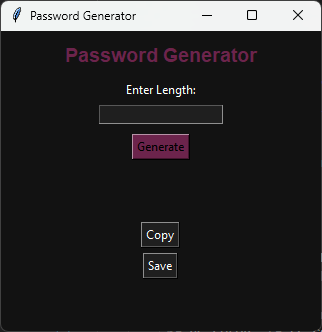
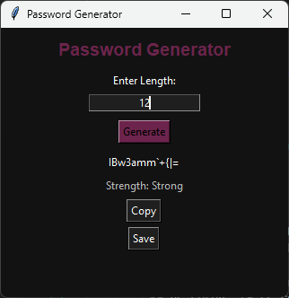
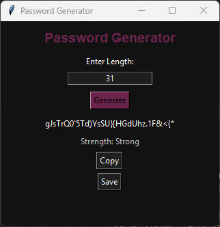

# Password Generator (Python)

A simple password generator with a graphical interface built using Python and Tkinter.

## 📸 Screenshots

### Main Interface


### Generated Password


### Strength Indicator


---

## Features

- Generate random passwords  
- Set password length (4–32 characters)  
- Displays password strength  
- Copy password to clipboard  
- Save generated passwords to a JSON file  

---

## Technologies Used

- Python  
- Tkinter  
- JSON file handling  

---

## How to Run

1. Clone the repository  

2. Run the program:
```bash
python app.py